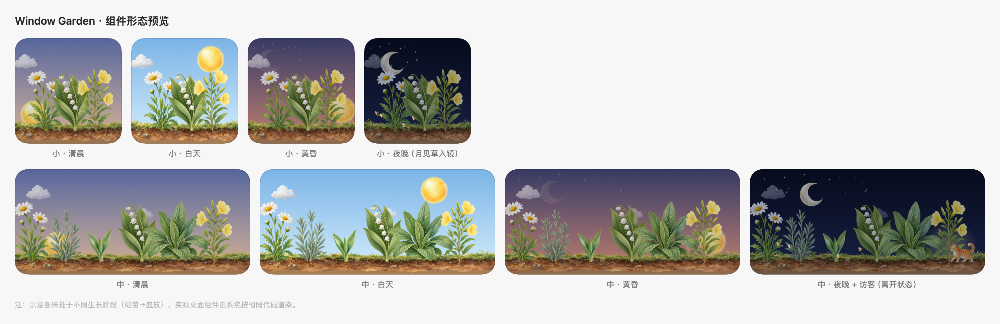

# Window Garden · 窗口花园

一个 macOS 桌面陪伴应用：**桌面上的一个 WidgetKit 小组件**，一座随你的使用状态慢慢生长的手绘小花园。
产品规格见 [SPEC.md](SPEC.md)，插画生成记录与换装指南见 [ART_PROMPTS.md](ART_PROMPTS.md)。



## 架构

- **菜单栏引擎**（WindowGarden.app，无 Dock 图标）：常驻后台，测量你的活跃时长、推进植物生长、记录离开/回归，并把变化推送给组件。它是花园唯一的计时器。
- **桌面组件**（WindowGardenWidget，WidgetKit 扩展）：真正的 macOS 系统组件，在组件库里叫「窗口花园」，小/中两个尺寸，由你添加到桌面。它住在桌面层，永远在所有窗口之下，不遮挡任何应用。组件按系统调度的快照刷新（相位边界 + 生长/离开事件），没有逐帧动画、没有常驻渲染。

## 构建与运行

```sh
./scripts/make_app.sh --install   # 构建 + 安装到 /Applications + 注册进系统组件库
open /Applications/WindowGarden.app   # 启动引擎（菜单栏出现叶子图标）
```

> 组件库只收录标准位置（/Applications）的应用——放在项目 build/ 目录里时组件搜索不到。修改代码后重新 `make_app.sh --install` 再启动即可。

然后把组件添加到桌面：**点菜单栏的时间/日期 → 编辑组件 → 搜索「窗口花园」→ 选择尺寸添加**（或桌面空白处右键 → 编辑组件）。要求 macOS 14+。

引擎需要在后台运行，花园才会生长（引擎退出时花园静止，不枯萎、不倒退）。想要开机常驻，在菜单栏菜单里打开「开机自动启动」。

## 使用

- **生长**：持续使用电脑时植物缓慢生长（每累计约 8 活跃小时推进最幼的一株一个阶段，共 4 阶段）；植物永不枯萎。
- **昼夜**：跟随本地时间（清晨 05:30 / 白天 08:00 / 黄昏 17:30 / 夜晚 19:30），夜晚有星星、萤火虫与月见草柔光。
- **访客**：你离开约 5 分钟后，组件里会出现小动物；回来后它们散去。
- **小尺寸**自动展示最成熟的 3 株（夜晚会换上会发光的月见草）；**中尺寸**展示全部 6 株。
- **菜单栏**：`刷新组件`、`开机自动启动`、`关于`、`退出`（退出＝花园暂停生长）。

## 插画与换装

应用内置 36 张透明 PNG 手绘水彩插画（六种植物各四阶段、三只访客、七种环境元素、地面与菜单栏图标）。首次启动会将它们复制到本地插画目录，不覆盖已有的自定义文件。

自定义时，按 [ART_PROMPTS.md](ART_PROMPTS.md) 的命名替换此目录中的 PNG：

```
~/Library/Application Support/WindowGarden/art/
```

从菜单栏点「刷新组件」即可请求更新，无需改代码。删除 `~/Library/Application Support/WindowGarden/state.json` 可重置花园。

## 开发

```sh
swift run GardenPreview                          # 离屏渲染各尺寸×各时段的组件形态预览图
.build/release/WindowGarden --no-autolaunch      # 不注册登录项
.build/release/WindowGarden --growth-x 86400     # 加速生长（每秒注入 24h 活跃时长）
.build/release/WindowGarden --debug              # 每 5 秒输出心跳日志（stderr）
WG_STATE_DIR=/tmp/wg_test make_app.sh …          # 隔离状态目录
```

改完代码重新体验：`./scripts/make_app.sh --install`（swift 脚本调试可直接 `swift build`，但发布组件必须走 xcodebuild）。

### 关键实测结论（macOS 26）

- 全局空闲查询（`CGEventSource.secondsSinceLastEventType`）不需要任何系统权限
- 组件扩展**必须沙盒化**才会被系统组件门禁收录（未沙盒的扩展被静默忽略）
- 组件库只收录 **/Applications** 标准位置的应用
- **SwiftPM（`swift build`）直接产出的组件扩展会被系统静默拒绝**——必须经 Xcode/xcodebuild 构建（本仓库因此采用 `.xcodeproj` + 引用本地 SwiftPM 包的混合结构）

## 卸载

1. 菜单栏 → 关闭「开机自动启动」（或系统设置 → 登录项中移除 WindowGarden）
2. 长按桌面上的花园组件 → 移除
3. 菜单栏 → 退出，删除 `/Applications/WindowGarden.app`
4. 删除 `~/Library/Application Support/WindowGarden/`
